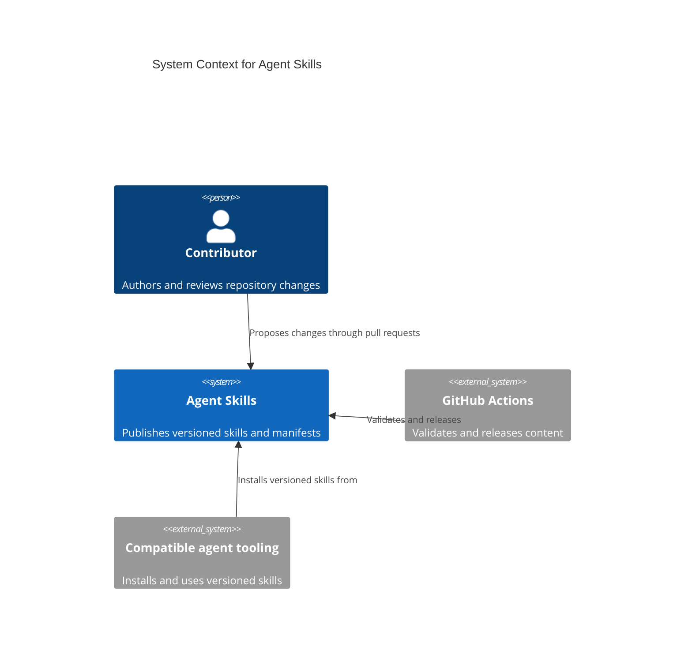

# System Context

This repository is a versioned public catalog of reusable agent skills. Its
repository-owned validators and GitHub Actions workflows keep published content
well-formed, tested, and suitable for public use.

Update this diagram when the repository's publishing, validation, release, or
consumption boundaries change.
