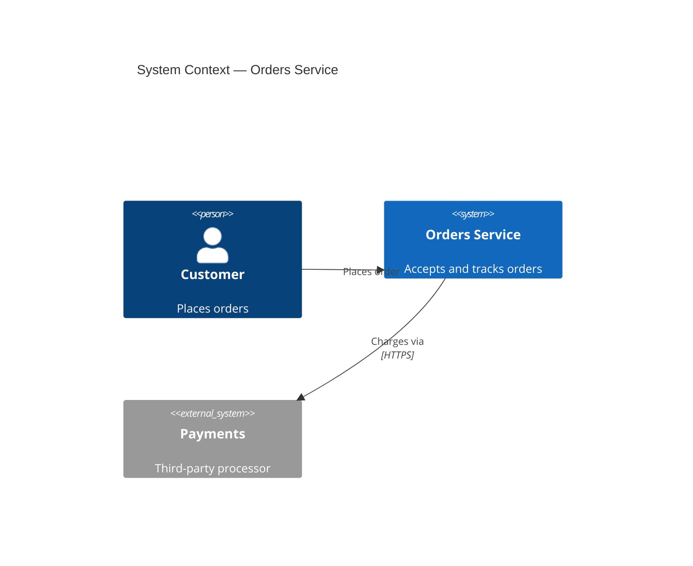

# C4 Architecture Documentation

C4 is a methodology, not a notation: it documents a system at four zoom levels
so each audience sees the right amount of detail. The discipline is **choosing
the level deliberately and stopping early** — most teams over-diagram.

## The four levels — pick by audience

| Level | Diagram | Audience | Shows | When |
|---|---|---|---|---|
| 1 | `C4Context` | Everyone | The system + the people/systems around it | **Always** |
| 2 | `C4Container` | Technical | Apps, services, databases inside it | **Always** |
| 3 | `C4Component` | Developers | Internals of one container | Only if it adds value |
| 4 | `C4Deployment` | Ops | Infra nodes the containers run on | Production systems |

**Context + Container is enough for most software teams.** Reach for Component
only when one container is complex enough that its internals are a real
question; reach for Deployment when how-it-runs matters. A diagram nobody asked
a question about is maintenance debt.

## Workflow

1. **Scope** — decide which level(s) the audience actually needs (default: 1+2).
2. **Analyze** — read the codebase to identify the real containers (deployable
   units) and their relationships, not the aspirational architecture.
3. **Generate** — write the diagrams in Mermaid C4 syntax (see `mermaid-diagrams`
   for the rendering mechanics).
4. **Document** — commit them to markdown with a sentence of context per diagram
   explaining what decision it informs.

## Example — Level 1

## Keep it true

Architecture docs are only valuable if they match reality — diagram the
containers that actually deploy, and update the C4 markdown in the same PR that
changes the architecture. A pretty diagram of a system that no longer exists is
worse than none.

---

_Adapted from the MIT-licensed [softaworks/agent-toolkit](https://github.com/softaworks/agent-toolkit) `c4-architecture` skill._
