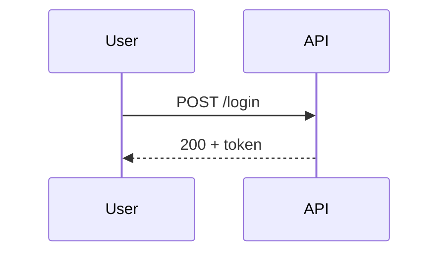
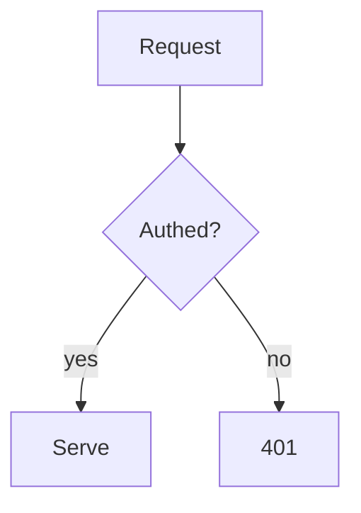

# Mermaid Diagrams

Mermaid renders diagrams from plain text, so they version, diff, and review like
code instead of rotting as exported PNGs. The skill is mostly in **choosing the
right diagram type** for the question being answered — the syntax is the easy
part.

## Pick the type from the question

| The question you're answering | Diagram type |
|---|---|
| What are the objects/domain and how do they relate? | `classDiagram` |
| What talks to what, in what order, over time? | `sequenceDiagram` |
| What's the process / decision flow? | `flowchart` |
| What's the database shape? | `erDiagram` |
| What states can this thing be in? | `stateDiagram-v2` |
| How does the system fit together at a high level? | C4 (`C4Context`/`C4Container`) — see the `c4-architecture` skill |

If you can't name the question, you don't need a diagram yet.

## The shape

Every diagram starts with the type, then its body:





## Gotchas that waste the most time

- **Unknown keywords fail silently or break the whole diagram** — a typo'd
  diagram-type or arrow renders nothing useful. Start from a known-good example
  and mutate it.
- **Reserved characters in labels** (`()`, `:`, `;`, `#`) need quoting:
  `A["Node (v2)"]`. This is the #1 cause of "it won't render."
- **Direction matters for readability** — `TD` (top-down) for processes/trees,
  `LR` (left-right) for pipelines and wide flows.
- **Keep one diagram to one idea.** A 40-node flowchart is unreadable; split it.

## Make it a repo artifact

Write the diagram into a fenced ```` ```mermaid ```` block in a markdown file
checked in next to the code it describes (README, ADR, `docs/`). GitHub and most
renderers display it inline, and it updates in the same PR as the change it
documents — that's the whole point of text diagrams over image exports.

---

_Adapted from the MIT-licensed [softaworks/agent-toolkit](https://github.com/softaworks/agent-toolkit) `mermaid-diagrams` skill._
